<p align="center">
  
</p>

<div align="center">

**[collapseindex.org](https://collapseindex.org)** • **[ORCID: 0009-0002-2566-5538](https://orcid.org/0009-0002-2566-5538)** • **[ask@collapseindex.org](mailto:ask@collapseindex.org)**

[](LICENSE.md)
[](https://collapseindex.org)
[](https://github.com/sponsors/collapseindex)

> ⚠️ **Note:** The `main` branch is read-only. No formulas or metric implementations are released here.

</div>

---

## 📄 Validation Studies

<table>
<tr>
<td colspan="2">

### 📘 Framework Paper (v1.0)
**Core methodology, theoretical bounds, and design principles of the Collapse Index.**

📄 [DOI: 10.5281/zenodo.17718180](https://doi.org/10.5281/zenodo.17718180)

</td>
</tr>
<tr>
<td width="50%">

### 🌟 Supernova Transient Detection
**CI applied to astrophysical transient detection in synthetic supernova light curves.**

📄 [DOI: 10.5281/zenodo.17772634](https://doi.org/10.5281/zenodo.17772634)

</td>
<td width="50%">

### 🛰️ ESA Satellite Telemetry
**First real-world operational validation on ESA satellite telemetry data.**

📄 [DOI: 10.5281/zenodo.17776643](https://doi.org/10.5281/zenodo.17776643)

</td>
</tr>
<tr>
<td width="50%">

### 🧪 LLM Robustness Testing (CrackTest)
**CI applied to LLM robustness using morphology-aligned perturbations.**

📄 [DOI: 10.5281/zenodo.17850893](https://doi.org/10.5281/zenodo.17850893)

</td>
<td width="50%">

### 🏗️ Structural Retention Index (SRI)
**Orthogonal stability metric complementing CI.**

📄 [DOI: 10.5281/zenodo.18016507](https://doi.org/10.5281/zenodo.18016507)

</td>
</tr>
</table>

---

# Collapse Index (CI) README v2.0.0

<p align="left">
  <em>A diagnostic framework for detecting silent instability in ML systems.</em>
</p>

## 🎯 Introduction

**Collapse Index (CI)** is an evaluation methodology that catches model failures before they show up in accuracy metrics.

Most ML evaluation asks: *"Is the model getting the right answers?"*

CI asks: *"Is the model becoming unreliable before the errors appear?"*

### The Core Problem

Many ML systems fail silently—remaining accurate and confident while becoming structurally unstable under small, meaning-preserving perturbations. By the time accuracy drops, the damage is done.

**The operators don't know. The model doesn't know. But the structure knows.**

### The CI Approach

CI separates model behavior into **three independent signals**:
- **Collapse (CI):** How much predictions drift under meaning-preserving changes
- **Structural Retention (SRI):** Whether internal decision structure holds together
- **Confidence:** What the model thinks about its own predictions

When these signals **disagree**, that divergence is the early warning.

---

## 📚 Table of Contents

**Understanding CI:**
- [🎯 Introduction](#-introduction) *(you are here)*
- [🚨 The Failure Mode](#-the-failure-mode)
- [🔍 How CI Works: Three Signals](#-how-ci-works-three-signals)
- [➡️ The CI Workflow](#the-ci-workflow)

**Using CI:**
- [🔌 Integration Requirements](#-integration-requirements)
- [📑 The Collapse Log](#-the-collapse-log)
- [⭐ Why CI + Collapse Log Matter](#-why-ci--collapse-log-matter)
- [🎯 Public Validation Results](#-public-validation-results)

**Context & Positioning:**
- [📍 What CI Is (And Isn't)](#-what-ci-is-and-isnt)
- [🏗️ About SRI](#️-about-sri)
- [❓ FAQ](#-faq)

**Project Info:**
- [🗺️ Roadmap 2026](#️-roadmap-2026)
- [⚠️ Official Status](#️-official-status)
- [📄 License & Citation](#-license--citation)
- [🧑🏻‍🔬 Author & Contact](#-author--contact)
- [💖 Sponsors](#-sponsors)

---

## 🚨 The Failure Mode

**A typical scenario:**
- ✅ Accuracy: ~96%
- ✅ AUC: ~0.90
- ✅ Mean confidence: high
- ✅ Calibration: "acceptable"

**Yet under meaning-preserving perturbations:**
- ❌ Predictions flip frequently
- ❌ Internal decision structure degrades
- ❌ Confidence remains high or even increases

**This is worse than an obviously uncertain model—it fails confidently and silently.**

---

## 🔍 How CI Works: Three Signals

Rather than proposing a single score, CI treats model behavior as **three separable signals**:

### 1. Collapse Index (CI)

**What it measures:** How much predictions drift or flip under meaning-preserving perturbations

**Question it answers:** *"Does this model behave consistently when nothing important changes?"*

**Example:** A paraphrase shouldn't flip "STABLE" to "UNSTABLE"

---

### 2. Structural Retention Index (SRI)

**What it measures:** Whether the model's internal decision structure remains coherent across variants

**Question it answers:** *"Is the model internally stable, or just coincidentally correct?"*

**Key insight:** A model can output the same answer for the wrong reasons. SRI catches this.

---

### 3. Confidence

**What it measures:** How strongly the model believes its own predictions

**Question it answers:** *"Does the model think it is correct?"*

**The problem:** Confidence is often a weak predictor of actual correctness.

---

### Why Three Signals?

**It's not the individual metrics—it's how these signals disagree.**

Across evaluations, we consistently find:
- ❌ **Confidence** has near-chance ability to separate correct vs incorrect predictions
- ✅ **CI/SRI** separate future errors substantially better
- ⚠️ **Most dangerous regime:** High confidence + High collapse

**In other words: Models often don't know when they're wrong—but their structure does.**

### Design Principles

- **Bounded scores (0–1):** Clear, comparable measures
- **Lightweight stressors:** Paraphrases, rewordings, not adversarial attacks
- **Reproducibility:** Each run produces sealed artifact bundles
- **Domain-agnostic:** Works on text, vision, time-series, medical data
- **Audit-aligned:** Designed for governance, not leaderboards

### Why CI and SRI Have the Same AUC

CI and SRI aren't competing metrics. They're **two views of the same separability**:
- **CI:** Measures how much behavior moves
- **SRI:** Measures how much structure stays intact
- **Relationship:** CI + SRI = 1.0 (exact)

They preserve the same ranking (same AUC), but force different interpretations:
- Is your model stable because it's genuinely robust?
- Or stable because everything else collapsed?

**You can't game one without paying a visible cost in the other.** That's intentional.

---

## ➡️ The CI Workflow

The **Collapse Index (CI)** is more than a metric: it’s a pipeline.  
Each run produces both a **bounded CI score** and a **collapse log** (row-level ledger of outcomes),  
then seals everything into an **audit-grade bundle**.  
  
This flowchart shows how CI integrates into evaluation, from setup to governance. 

```mermaid
flowchart LR
    A["<b>Setup</b><br>Prepare environment + model"] --> B["<b>Generation</b><br>Baseline + stress variants"]
    B --> C["<b>Metrics</b><br>Compute collapse signals"]
    C --> D["<b>Logging</b><br>Write collapse_log.csv (row-level)"]
    D --> Y["<b>Collapse Log</b><br>per-prompt ledger (CSV)"] & X["<b>CI Score</b><br>[0,1] aggregate from log"]
    X --> E["<b>Analysis</b><br>Stability vs. collapse"]
    Y --> E
    E --> F["<b>Reporting</b><br>Summaries · plots · tables"]
    F --> G["<b>Archival</b><br>Sealed bundle · checksum"]
    G --> H["<b>Governance</b><br>Licenses · disclosure"]
    E L_E_C_0@-. iteration .-> C
    H L_H_A_0@-. policy/reqs .-> A
     A:::eval
     B:::eval
     C:::eval
     D:::eval
     Y:::outputs
     X:::outputs
     E:::eval
     F:::audit
     G:::audit
     H:::audit
    L_E_C_0@{ animation: fast } 
    L_H_A_0@{ animation: fast }




```


 
> The CI framework integrates into the evaluation pipeline at two points:  
> • **Metrics (CI score):** collapse quantified into a bounded [0,1] score.  
> • **Collapse Log:** detailed, row-level record of every prediction and outcome.  
>  
> These plug into the broader evaluation cycle (analysis → reporting → archival → governance), producing sealed, audit-grade evidence of system stability.  

---

## 📍 What CI Is (And Isn't)

### ✅ What CI Is

- **A diagnostic framework** for detecting instability before accuracy drops
- **Stress-based evaluation** using benign, meaning-preserving perturbations
- **Audit-grade output** with row-level evidence (Collapse Log)
- **Domain-agnostic:** Works on any predictive system
- **Complementary** to existing evaluation methods

### ❌ What CI Is Not

- **Not a benchmark:** It's a diagnostic, not a leaderboard score
- **Not adversarial:** Uses natural variations, not adversarial attacks
- **Not OOD detection:** Measures behavior under semantic equivalence, not distribution shift
- **Not a replacement** for calibration, robustness, or standard metrics
- **Not open source:** Framework and formulas are proprietary

### How CI Differs

| Approach | What It Asks | What CI Asks |
|----------|-------------|---------------|
| **Standard Metrics** | "Is the model getting the right answers?" | "Is the model becoming unreliable before errors appear?" |
| **Adversarial Robustness** | "Can I break this model with worst-case inputs?" | "Does this model crack under normal variation?" |
| **OOD Detection** | "Where did this input come from?" | "How does the model behave when meaning hasn't changed?" |
| **Calibration** | "Does confidence match accuracy?" | "Does confidence predict failure, or does structure?" |

### Why This Matters

CI is designed for **safety- and governance-relevant deployments** where:
- A single silent failure can trigger recalls, lawsuits, or harm
- Operators need early warnings before cascading failures
- Audit trails and receipts are required
- Continuous monitoring must be computationally feasible

---

## 🏗️ About SRI

**Structural Retention Index (SRI)** is CI's complementary metric for measuring internal reasoning stability.

- **CI measures:** How much the model cracks under meaning-preserving perturbations  
- **SRI measures:** How well the model holds its decision structure across variants  
- **Perfect complementarity:** CI + SRI = 1.0 (exact)  

### Why SRI + CI?

Models can output consistent predictions while internal reasoning collapses.  
CI catches when your model cracks. SRI catches structural decay.  
Together, they reveal failures invisible to traditional metrics.

**Key insight:** A model can have stable predictions but collapsing internal reasoning.  
These are the cases that pass QA but fail in production under real-world stress.

👉 **Public Validations:**
- **AG News (Multi-class):** [github.com/collapseindex/ci-sri](https://github.com/collapseindex/ci-sri)
- **SST-2 (Binary):** [github.com/collapseindex/ci-sst2](https://github.com/collapseindex/ci-sst2)

📄 **Published paper:** [DOI: 10.5281/zenodo.18016507](https://doi.org/10.5281/zenodo.18016507)

---

## 🔌 Integration Requirements

### Required Data Format

**Simple CSV or Parquet dataset containing model predictions. No weights, no code.**

<table>
<thead>
<tr>
<th>id</th>
<th>variant_id</th>
<th>true_label</th>
<th>pred_label</th>
<th>confidence</th>
</tr>
</thead>
<tbody>
<tr>
<td><code>case_001</code></td>
<td><code>base</code></td>
<td><code>Positive</code></td>
<td><code>Positive</code></td>
<td><code>0.92</code></td>
</tr>
<tr>
<td><code>case_001</code></td>
<td><code>v1</code></td>
<td><code>Positive</code></td>
<td><code>Positive</code></td>
<td><code>0.89</code></td>
</tr>
<tr style="background-color: rgba(255, 100, 100, 0.1);">
<td><code>case_001</code></td>
<td><code>v2</code></td>
<td><code>Positive</code></td>
<td><code>Negative</code></td>
<td><code>0.71</code></td>
</tr>
<tr>
<td><code>case_002</code></td>
<td><code>base</code></td>
<td><code>Negative</code></td>
<td><code>Negative</code></td>
<td><code>0.95</code></td>
</tr>
<tr>
<td><code>case_002</code></td>
<td><code>v1</code></td>
<td><code>Negative</code></td>
<td><code>Negative</code></td>
<td><code>0.93</code></td>
</tr>
</tbody>
</table>

*⚠️ The third row shows a **flip** (same input semantics, different prediction). 3+ variants per base ID recommended.*

---

### Tiered Functionality

**Minimal Mode (label flips only)**
```csv
id, variant_id, true_label, pred_label
```
Both CI and SRI can compute from pure prediction disagreement. Works with **any classifier**, even hard decision systems.

**Standard Mode (full diagnostics) — HIGHLY RECOMMENDED**
```csv
id, variant_id, true_label, pred_label, confidence
```
Adds confidence scores for canonical analysis. This enables full structural diagnostics and separates the three signals (CI, SRI, Confidence) for complete stability analysis.

---

### Why This Matters

- ✅ **No model internals required:** Don't need logits, embeddings, attention weights, nothing. Just outputs.
- ✅ **No retraining:** Works on existing models as-is
- ✅ **No special infrastructure:** If you can log predictions to CSV, you can run this evaluation
- ✅ **Trivial integration:** Literally just log predictions in the right format
- ✅ **Retroactive analysis:** Have old prediction logs? Just reformat and run CI
- ✅ **Model-agnostic:** Works on neural nets, decision trees, ensembles, whatever
- ✅ **Works with ANY model:** Even ones that don't output confidence scores

### Quick Start

1. Take your existing test set
2. Generate paraphrases/variants (LLM, backtranslation, augmentation, whatever)
3. Run inference
4. Format as CSV
5. Get stability metrics

**No prompt engineering. No domain knowledge. No overfitting to specific test cases.**

The evaluation is completely **prompt-agnostic**. CI and SRI compute purely from the structure of disagreement, not the content of prompts.

---

## 📑 The Collapse Log

Every run produces a **Collapse Log**, an audit-grade CSV file that  
records per-prompt diagnostics, predictions, and human-friendly notes.  

Think of it as a **flight recorder for brittleness**:

- **Row-level evidence:** Each case is logged with detailed diagnostics capturing model behavior across variants
- **Receipts-grade:** The file is bundled alongside hashes and snapshots, ensuring that  
  results are **verifiable and audit-ready**  
- **Portable:** CSV format, lightweight, and works across pipelines

### The Triage Loop (Operational Use)

The system is designed for **fast safety triage**, not leaderboard optimization.

The triage loop reads from the **Collapse Log** and produces a **machine-readable CI/CD JSON** containing:

1. 🔍 Instability and retention failures ranked by severity
2. 📊 High-risk samples and cohorts grouped by failure type
3. 🔬 Concrete cases flagged for inspection

This typically fits into a **5–10 minute review loop** and provides structured output for automated pipelines.

---

## ⭐ Why CI + Collapse Log Matter  

AI models don't fail quietly. They **collapse**.  
Traditional metrics often miss brittleness until it causes real-world harm.  

- **Benchmarks ≠ Reality:** Models that ace leaderboards can still collapse.  
- **Liability Risk:** A single collapse may trigger recalls, lawsuits, or penalties.  
- **Audit Gap:** Standard metrics don't leave receipts; Collapse Log does.  
- **Efficiency:** Lightweight stressors mean continuous monitoring without massive compute.  
- **Trust:** Regulators and enterprises need a score they can verify **and a log they can audit.**

👉 CI + Collapse Log make collapse **measurable, reproducible, and audit-ready** before it becomes a public liability.  

---

## 🎯 Public Validation Results

### SST-2 Sentiment Analysis (Binary Classification)

This validation evaluated **DistilBERT-SST2** (90%+ benchmark accuracy) using Collapse Index on 500 sentiment examples from the SST-2 validation set.

**Results:**
- **42.8% flip rate:** Nearly half of predictions change under typos/paraphrases
- **CI Score: 0.275:** Minor drift detected
- **13 silent failures:** High confidence (>90%) BUT CI detects collapse (CI ≤ 0.45). These bypass traditional monitoring. (13 of 35 total high-conf errors)
- **AUC(CI): 0.698** vs **AUC(Confidence): 0.515:** CI predicts brittleness 18% better than confidence scores

**The gap:** Benchmarks say "ship it," but real-world input variations expose massive instability.

👉 **Full reproducible dataset & analysis:** [github.com/collapseindex/ci-sst2](https://github.com/collapseindex/ci-sst2)

---

### AG News (Multi-Class Classification with SRI)

This validation evaluated **BERT-AG-News** (90.8% benchmark accuracy) using **SRI + CI** on 500 examples across 4 news categories (World, Sports, Business, Sci/Tech).

**Results:**
- **9.2% flip rate:** 46/500 base examples flip under perturbations
- **CI Score: 0.019** (avg): Prediction instability metric
- **SRI Score: 0.981** (avg): Structural retention metric
- **CI + SRI = 1.000:** Perfect complementarity validated
- **AUC(CI): 0.874** | **AUC(SRI): 0.874:** Both vastly outperform confidence
- **AUC(Confidence): 0.171:** Near-chance performance
- **CSI Classification:** 479 Type I / 20 Type II / 1 Type III. Detailed failure mode analysis

**The insight:** Multi-class provides richer entropy signals for SRI validation. Models can be confidently wrong (Type I) or have hidden internal instability (Type II) that traditional metrics miss.

👉 **Full reproducible dataset & analysis:** [github.com/collapseindex/ci-sri](https://github.com/collapseindex/ci-sri)

---

### Key Takeaway

Both validations demonstrate that **structural signals (CI/SRI) consistently outperform confidence** for predicting model failures across binary and multi-class tasks.

---

## ❓ FAQ  

### 1. Is CI just another benchmark?

**No.** CI is not a leaderboard metric — it's a diagnostic. It reveals brittleness under benign stress.

---

### 2. Does CI replace calibration, OOD, or adversarial robustness?

**No.** CI complements these methods. It adds a collapse-sensitivity axis and receipts (Collapse Log™).

---

### 3. How is this different from adversarial robustness?

**Adversarial robustness** measures worst-case behavior under adversarial perturbations designed to break the model.

**CI** uses benign, meaning-preserving perturbations (paraphrases, rewordings) that users would naturally produce. The goal isn't finding adversarial examples—it's detecting when models are brittle under normal variation.

---

### 4. How is this different from OOD detection?

**OOD detection** asks "where did this input come from?"

**CI** asks "how does the model behave when the meaning hasn't changed?"

A paraphrase is in-distribution semantically but may trigger structural instability. These are orthogonal concerns.

---

### 5. Does CI have theoretical guarantees?

**No formal proofs.** The justification is **empirical and operational**, not formal. Across ESA satellite data, synthetic supernova collapse curves, BERT on AG News, and DistilBERT on SST-2, structural signals consistently outperform confidence for predicting failures.

---

### 6. Is CI adversarial?

**No.** CI relies on lightweight, domain-appropriate perturbations (e.g., paraphrases, pixel shifts). Collapse is measured without adversarial tuning.

---

### 7. How reproducible are CI runs?

Every run emits a full artifact bundle: logs, plots, cryptographic hashes, and a Collapse Log.

---

### 8. Does CI scale?

**Yes.** CI stabilizes at a small perturbation budget, so continuous monitoring is feasible without massive compute overhead.

---

### 9. Why didn't you use more metrics?

**Short answer:** The design prioritizes avoiding false reassurance over maximizing metric coverage.

Early versions experimented with more standard metrics: additional accuracy variants, calibration scores, robustness checks, distributional tests.

**Repeated observations showed:** Most of them moved together, and usually moved late. They answered the same question in slightly different ways: *"Is the model currently getting the right answers?"*

That's useful—but not the critical question.

**The failure mode of concern occurs earlier in time:** *"Is this model becoming unreliable before obvious errors appear?"*

Adding more correlated metrics often made things look more convincing without making them safer. Everything agreed… right up until it didn't.

So the system deliberately limits itself to **three signals that can disagree with each other** in meaningful ways:
- How much behavior changes when it shouldn't
- Whether internal structure holds together
- Whether confidence actually tracks correctness

When those signals line up, the model is probably fine. **When they diverge, that divergence itself is the warning.**

In practice, three interpretable signals that can contradict each other are more useful for decision-making than ten metrics that all nod at once.

---

## 🗺️ Roadmap 2026

- ✅ **Finalize framework draft and publish**
- ✅ **Build diagnostic software/app:** Packaging CI + Collapse Log as a tool
- 🔄 **Run additional experiments:** Scaling to larger models (e.g., Qwen 7B)
- 🔄 **Collaborate with labs and organizations:** External validation and pilots
- 🎯 **Frontier model testing:** GPT-4/Claude runs (seeking API credits/collaboration)

**Want to collaborate?** Reach out at [ask@collapseindex.org](mailto:ask@collapseindex.org)

---

## ⚠️ Official Status  

Collapse Index (CI) and Collapse Log are **not released as open-source software.**  
There is **no official repository** providing formulas or internals.  

Any third-party code claiming to implement CI or Collapse Log is:  
🚫 **Unofficial, unverified, and not endorsed.**  

---

## 📄 License & Citation  

### License

- The terms *Collapse Index (CI)*, *Structural Retention Index (SRI)*, and related technologies are reserved by the author
- Unauthorized use or misrepresentation is prohibited
- This repo does not contain source code or formulas

📄 Full terms: [LICENSE.md](LICENSE.md)

### Citation

If you reference Collapse Index (CI) in your research or evaluations, please cite:

```bibtex
@misc{kwon2025collapseindex,
  author = {Kwon, Alex},
  title = {Collapse Index (CI) GitHub README},
  year = {2026},
  publisher = {Collapse Index Labs},
  howpublished = {\url{https://github.com/collapseindex/collapseindex}},
  version = {v2.0.0},
  note = {Framework Paper DOI: 10.5281/zenodo.17718180}
}
```

---

## 🧑🏻‍🔬 Author & Contact  

Collapse Index Labs (Alex Kwon)  
- Website → [collapseindex.org](https://collapseindex.org)  
- ORCID → [0009-0002-2566-5538](https://orcid.org/0009-0002-2566-5538)  

**For evals, datasets, collaborations, or pilots:**  
📩 **ask@collapseindex.org**

**For evaluation services:**  
🌐 Visit [Collapse Index Evals](https://collapseindex.org/evals.html) for more information

---

## 💖 Sponsors  

Collapse Index research is made possible through community support.  

### 📡 Transmission Tier (Major Sponsors)  
*Be the first founding Transmission sponsor.*  

### 📻 Feedback Tier (Contributors)  
*Be the first founding Feedback sponsor.*  

👉 [Sponsor CI on GitHub](https://github.com/sponsors/collapseindex)  

---
